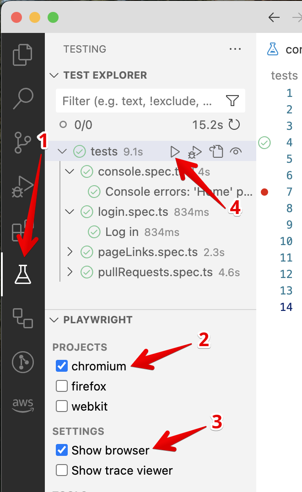

# Lux Experience Automation Framework

This project is a Playwright + TypeScript testing framework that provides utilities for API and UI testing.

## How to run and work with project

1. Install IDE (e.g. Visual Studio Code https://code.visualstudio.com/)
2. Clone the repository to your local machine
3. VS code terminal: Run `npm install` command to installs all project dependencies
4. VS code terminal: Run `npx playwright install --with-deps` command to install Playwright with all browsers
5. VS code IDE: Install `Playwright Test for VSCode` extension
8. Copy `.env_example` file and rename it into `.env`, past the needed BASE_URL
9. You are ready to run tests

## How to run tests

### How to run tests from VS code extension

1. Open Playwright extension
2. Select browser
3. Select running mode
4. Click the 'run' button of specific test or all tests

### How to run tests from command line

See all possible ways how to run tests from terminal here: https://playwright.dev/docs/running-tests

Example: 
Run *login* test in *chromium* in *UI* mode: `npx playwright test tests/login.spec.ts --project=chromium --headed`

### How to see test report

Run command in VS-code terminal: `npx playwright show-report`
